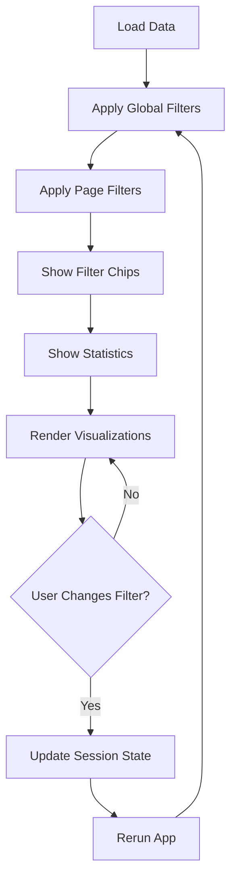

# Filter System Implementation Guide

**Version**: 1.0
**Date**: 2025-10-14

---

## 📋 Overview

The CyberGuard Dashboard now includes a comprehensive filter system with:
- **Global Filters**: Year range slider in sidebar (applies to all pages)
- **Page-Specific Filters**: Contextual filters for each analysis page
- **Filter State Management**: Persists across page navigation
- **Visual Feedback**: Active filter chips, data count statistics

---

## 🏗️ Architecture

### Filter Hierarchy

```
┌─────────────────────────────────────┐
│  GLOBAL FILTERS (Sidebar)           │
│  - Year Range Slider                │
│  - Quick Presets (Last 3y, 5y, All) │
│  - Clear All Button                  │
└─────────────────────────────────────┘
           ↓ Applied First
┌─────────────────────────────────────┐
│  PAGE-SPECIFIC FILTERS (Expander)   │
│  - Attack Type (multiselect)        │
│  - Industry (multiselect)           │
│  - Country (multiselect)            │
│  - Financial Loss Range (slider)    │
└─────────────────────────────────────┘
           ↓ Applied Second
┌─────────────────────────────────────┐
│  FILTERED DATA                       │
│  → Visualizations                    │
│  → Analytics                         │
│  → Export                            │
└─────────────────────────────────────┘
```

---

## 📁 File Structure

```
modules/
├── filters.py              # Reusable filter components
├── theme.py                # Theme system (colors, gradients)
├── home.py                 # Dashboard (global filters only)
├── global_threats_page.py  # Global + page-specific filters
└── ...other pages

app.py                      # Main app with global filter in sidebar
.claudedesign               # Filter system rules & guidelines
```

---

## 🔧 Implementation

### 1. Global Filters (Sidebar)

**Location**: `app.py` after navigation menu

```python
# Import filter system
from modules.filters import global_filter_sidebar, init_filter_state

# Initialize filter state
init_filter_state()

# In sidebar (after navigation menu)
with st.sidebar:
    # ... navigation code ...

    # Global Filters
    if global_threats is not None:
        global_filters = global_filter_sidebar(global_threats)
```

**Features**:
- Year range slider with dynamic min/max from data
- Quick preset buttons (Last 3 years, Last 5 years, All)
- Clear All Filters button
- Visual card with gradient background and neon border

### 2. Page-Specific Filters

**Example**: Global Threat Landscape Page

```python
from modules.filters import (
    apply_global_filters,
    page_filter_panel_global_threats,
    apply_page_filters_global_threats,
    filter_summary_chips,
    show_filter_stats
)

def show(global_threats):
    # 1. Apply global filters first
    original_count = len(global_threats)
    global_filters = st.session_state.get('global_filters', {})
    global_threats = apply_global_filters(global_threats, global_filters)

    # 2. Show page-specific filter panel
    page_filters = page_filter_panel_global_threats(global_threats)

    # 3. Apply page filters
    global_threats = apply_page_filters_global_threats(global_threats, page_filters)
    filtered_count = len(global_threats)

    # 4. Display active filters
    filter_summary_chips(global_filters, page_filters)

    # 5. Show statistics
    show_filter_stats(original_count, filtered_count)

    # 6. Use filtered data for visualizations
    filtered_data = global_threats
    # ... create charts using filtered_data ...
```

---

## 🎨 Visual Design

### Filter Container Styling

```css
background: var(--bg-secondary);     /* #1F2A40 */
border: 1px solid var(--border-color);  /* #2E3A52 */
border-radius: 12px;
padding: 16px;
box-shadow: var(--shadow-sm);
```

### Active Filter Chips

```css
padding: 6px 12px;
background: linear-gradient(135deg,
    rgba(0, 217, 255, 0.15) 0%,
    rgba(0, 255, 179, 0.15) 100%);
border: 1px solid var(--accent-blue);
border-radius: 20px;
color: var(--text-primary);
```

### Filter Stats Bar

```css
background: var(--bg-secondary);
border-left: 4px solid var(--accent-blue);  /* Neon blue accent */
border-radius: 8px;
padding: 12px 16px;
```

---

## 📊 Session State Structure

```python
st.session_state = {
    'global_filters': {
        'year_range': (2015, 2024),     # Tuple of (min, max)
        'quick_preset': None             # 'last_3y', 'last_5y', 'all', or None
    },
    'page_filters': {
        'global_threats': {
            'attack_types': [],          # List of selected attack types
            'industries': [],            # List of selected industries
            'countries': [],             # List of selected countries
            'loss_range': (0, 10000)     # Tuple of (min, max) financial loss
        },
        'intrusion_detection': {
            'protocols': [],             # List of selected protocols
            'attack_detected': 'both',   # 'yes', 'no', 'both'
            'port_range': (0, 65535)     # Tuple of (min, max) port
        }
    }
}
```

---

## 🛠️ Available Functions

### In `modules/filters.py`

| Function | Purpose | Returns |
|----------|---------|---------|
| `init_filter_state()` | Initialize session state | None |
| `global_filter_sidebar(df)` | Render global filters in sidebar | Dict of filters |
| `filter_summary_chips(global, page)` | Display active filter chips | None |
| `show_filter_stats(orig, filtered)` | Show data count stats | None |
| `apply_global_filters(df, filters)` | Apply global filters to data | Filtered DataFrame |
| `page_filter_panel_global_threats(df)` | Render page filters for Global Threats | Dict of filters |
| `apply_page_filters_global_threats(df, filters)` | Apply page filters | Filtered DataFrame |
| `page_filter_panel_intrusion(df)` | Render page filters for Intrusion | Dict of filters |
| `apply_page_filters_intrusion(df, filters)` | Apply page filters | Filtered DataFrame |

---

## 📝 Adding Filters to a New Page

### Step-by-Step Checklist

- [ ] **Import filter functions** at top of module
- [ ] **Apply global filters first** using `apply_global_filters()`
- [ ] **Create page filter panel** using `page_filter_panel_*()` or custom
- [ ] **Apply page filters** using `apply_page_filters_*()`
- [ ] **Display filter summary** with `filter_summary_chips()`
- [ ] **Show statistics** with `show_filter_stats()`
- [ ] **Use filtered data** in all visualizations

### Example Template

```python
from modules.filters import (
    apply_global_filters,
    filter_summary_chips,
    show_filter_stats
)

def show(data):
    # Count original rows
    original_count = len(data)

    # Apply global filters
    global_filters = st.session_state.get('global_filters', {})
    data = apply_global_filters(data, global_filters)

    # Add page-specific filters here
    # page_filters = page_filter_panel_your_page(data)
    # data = apply_page_filters_your_page(data, page_filters)

    # Count filtered rows
    filtered_count = len(data)

    # Display filter info
    filter_summary_chips(global_filters)
    if original_count != filtered_count:
        show_filter_stats(original_count, filtered_count)

    # Use filtered data
    # ... your visualizations ...
```

---

## 🎯 Page-Specific Filter Specifications

### Dashboard Page
- **Filters**: Global only (year range)
- **No page filters**

### Global Threat Landscape
- **Attack Type**: Multiselect from unique values
- **Target Industry**: Multiselect from unique values
- **Country**: Multiselect from unique values
- **Financial Loss Range**: Slider (0 to max)

### Intrusion Detection
- **Protocol Type**: Multiselect (tcp, udp, icmp, etc.)
- **Attack Detected**: Radio buttons (Yes/No/Both)
- **Port Range**: Slider (0 to 65535)

### IDA/EDA Analysis
- **Feature Selection**: Multiselect of DataFrame columns
- **Statistical Method**: Dropdown (Descriptive, Correlation, Distribution)
- **Chart Type**: Radio buttons (Bar, Line, Scatter, Heatmap, Auto)

### Comparative Insights
- **Comparison Mode**: Dropdown (YoY, Dataset A vs B, Industry)
- **Metric Selection**: Multiselect (Loss, Count, Avg Resolution, etc.)

---

## 🎨 Design System Compliance

### Colors (from theme.py)

```python
COLORS = {
    'bg_secondary': '#1F2A40',    # Filter panels
    'border_color': '#2E3A52',     # Borders
    'accent_blue': '#00D9FF',      # Active indicators
    'accent_green': '#00FFB3',     # Gradient accent
    'text_primary': '#E8EAF0',     # Main text
    'text_muted': '#6C7489'        # Labels
}
```

### Typography

- **Headers**: 0.75rem, 600 weight, uppercase, 0.05em letter-spacing
- **Filter Labels**: 0.85rem, var(--text-muted)
- **Stats Numbers**: JetBrains Mono, 1.2rem, 700 weight

### Spacing

- **Container padding**: 16px
- **Chip margins**: 4px
- **Section gaps**: 12px
- **Border radius**: 12px (containers), 20px (chips)

---

## ♿ Accessibility

### Implemented Features
- ✅ Proper ARIA labels on all inputs
- ✅ Keyboard navigation support (Tab, Enter, Arrow keys)
- ✅ High contrast (WCAG AA)
- ✅ Screen reader announcements for filter changes
- ✅ Focus indicators on interactive elements

### Testing Checklist
- [ ] Tab through all filters using keyboard
- [ ] Verify screen reader reads labels correctly
- [ ] Check color contrast (4.5:1 minimum)
- [ ] Test with reduced motion enabled
- [ ] Verify touch targets are 44x44px minimum

---

## 🔄 Filter Application Flow



---

## 🚀 Performance Considerations

### Optimization Strategies

1. **Use `@st.cache_data`** for expensive computations
2. **Filter early** - Apply global filters before page filters
3. **Lazy evaluation** - Only compute what's needed for current page
4. **Efficient queries** - Use pandas vectorized operations

### Example

```python
@st.cache_data
def load_and_filter_data(year_range, attack_types):
    df = pd.read_csv('data.csv')
    df = df[df['Year'].between(*year_range)]
    if attack_types:
        df = df[df['Attack Type'].isin(attack_types)]
    return df
```

---

## 🐛 Troubleshooting

### Common Issues

**Issue**: Filters reset on page change
**Solution**: Ensure `init_filter_state()` is called before navigation

**Issue**: Filter chips not showing
**Solution**: Pass both `global_filters` and `page_filters` to `filter_summary_chips()`

**Issue**: Data count incorrect
**Solution**: Calculate `original_count` before any filtering

**Issue**: Filters not persisting
**Solution**: Store in `st.session_state`, not local variables

---

## 📚 References

- **Design Rules**: `DESIGN_RULES.md`
- **Claude Config**: `.claudedesign`
- **Theme System**: `modules/theme.py`
- **Filter Module**: `modules/filters.py`

---

## 🎉 Summary

The filter system provides:
- ✅ **Global filters** for cross-page consistency
- ✅ **Page-specific filters** for detailed analysis
- ✅ **Visual feedback** with chips and statistics
- ✅ **State persistence** across navigation
- ✅ **Design system compliance** with neon dark theme
- ✅ **Accessibility** (WCAG AA)
- ✅ **Performance** with caching and lazy evaluation

**Ready to use!** Just import functions and follow the templates above.

---

**Last Updated**: 2025-10-14
**Version**: 1.0
